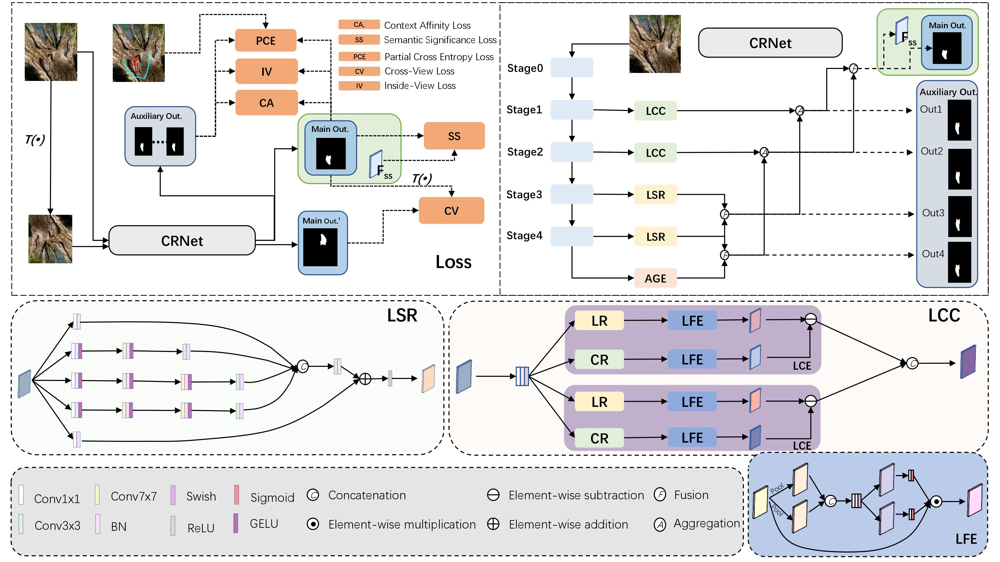

# EBP-Net: Weakly-Supervised Camouflaged Object Detection with Scribble Annotations

This repository provides an implementation of **EBP-Net** (Extraction, Boundary-guided, and Perception Network) for weakly-supervised camouflaged object detection (WSCOD) using scribble annotations.

---

## Framework Overview



### Pipeline

1. **Scribble Annotations**: Foreground scribbles (value=1) + background scribbles (value=2), most pixels unlabeled (value=0). Annotating one image takes only 1-2 seconds, vs. ~60 minutes for full pixel masks.
2. **Synthetic Data Generation**: From scribble annotations, automatically connect the nearest background-foreground point pair via KDTree, create a texture-filled path, and produce synthetic camouflaged regions (Simulated Concave Region).
3. **EBP-Net Training**: Original + synthetic images through shared-weight network with mutual supervision. 10 synthetic variants per image, randomly sampled each iteration.
4. **Inference**: Single forward pass, no synthetic generation or post-processing needed.

---

## Installation

```bash
git clone https://github.com/LiuMingYy/weakly_supervised_camouflage_object_detection.git
cd weakly_supervised_camouflage_object_detection

conda create -n ebpnet python=3.8 -y && conda activate ebpnet

# PyTorch
pip install torch==1.12.1+cu116 torchvision==0.13.1+cu116 --extra-index-url https://download.pytorch.org/whl/cu116

# MMCV
pip install mmcv-full==1.7.1 -f https://download.openmmlab.com/mmcv/dist/cu116/torch1.12.0/index.html

# Other dependencies
pip install -r model_zoo/CRNet/Weakly-Supervised-Camouflaged-Object-Detection-with-Scribble-Annotations-main/requirements.txt
pip install timm thop
```

---

## Data Preparation

### Download

| Dataset | Source | Size |
|---------|--------|------|
| **COD10K-V3** | [Official COD10K Page](https://dengpingfan.github.io/pages/COD.html) | 2.3 GB |
| **CAMO-V1.0** | [Official CAMO Page](https://sites.google.com/view/ltnghia/research/camo?authuser=2) | 286 MB |
| **S-COD Scribbles** | [CRNet GitHub](https://github.com/dddraxxx/Weakly-Supervised-Camouflaged-Object-Detection-with-Scribble-Annotations) | 13 MB |
| **COD10K + CAMO + Scribbles (packed)** | [阿里云盘](https://www.alipan.com/t/gjXbKqXrErQ4vmiK37uN) | ~2.6 GB |

### Pretrained Weights

| Item | Link |
|------|------|
| **PVT v2 B3** (backbone) | [whai362/PVT Releases](https://github.com/whai362/PVT/releases/download/v2/pvt_v2_b3.pth) |
| **EBP-Net 10-variant** (our checkpoint) | [Google Drive](https://drive.google.com/file/d/1VXNNGL3QJClUzBqm-T6tpq-tlWXr9qV_/view?usp=sharing) |

### Directory Structure

Extract and organize as follows (we use `/root/autodl-tmp` as `$DATAROOT`; modify paths in `dataset.py` and `train.py` to match your setup):

```
$DATAROOT/
├── COD10K/
│   ├── COD10K-v3/
│   │   ├── Train/Image/              # 6,000 training images (.jpg)
│   │   ├── Train/GT_Object/          # 6,000 training GT masks (.png)
│   │   ├── Test/Image/               # 4,000 test images (.jpg)
│   │   └── Test/GT_Object/           # 4,000 test GT masks (.png)
│   └── TrainDataset/
│       ├── synthetic/                # Generated below
│       │   ├── 1_img/   1_label/
│       │   └── ...      10_img/  10_label/
│       └── TestDataset/COD10K/
│           └── test.txt              # 2,026 COD10K-CAM test filenames
├── CAMO/
│   └── CAMO-V.1.0-CVIU2019/
│       ├── Images/Train/             # 1,000 training images
│       └── GT/                       # CAMO GT masks
├── Scribble/                         # S-COD scribble PNGs (4,040 files)
└── model_results/
    ├── backbone_weights/
    │   └── pvt_v2_b3.pth
    └── weaklySup/CRNet/
        └── SARNet_10v_COD10K/        # Training outputs
```

---

## Synthetic Data Generation

The generation script (`generation_exp/generation.py`) reads scribble annotations and produces synthetic camouflaged images:

1. **Point Selection**: Find all foreground (value=1) and background (value=2) pixels from the scribble; use KDTree to locate the nearest bg-fg pair.
2. **Path Generation**: Create a variable-width (10-15 pixels) path connecting the two points, simulating a "concave" camouflage region.
3. **Texture Filling**: Crop a 15×15 texture patch from the background starting point, mirror-expand it to 45×45, then tile-fill the path region with Gaussian-blur feathering.
4. **Output**: Synthetic RGB image, enhanced scribble (path region marked as background=2), and Simulated Concave Region (SCR) binary mask.

Run **10 times** to generate 10 random variants per image (matching the paper):

```bash
cd generation_exp/

for run in {1..10}; do
    python generation.py \
        --cod_image_dir $DATAROOT/COD10K/COD10K-v3/Train/Image \
        --camo_image_dir $DATAROOT/CAMO/CAMO-V.1.0-CVIU2019/Images/Train \
        --scribble_dir $DATAROOT/Scribble \
        --out_img_dir $DATAROOT/COD10K/TrainDataset/synthetic/${run}_img \
        --out_scr_dir $DATAROOT/COD10K/TrainDataset/synthetic/${run}_label
done
```

**Output**: ~4,027 image pairs × 10 variants (3,035 COD10K + 992 CAMO). During training, one variant is randomly selected per iteration via `random.randint(0, 9)`.

---

## Training

### Hyperparameters

| Parameter | Value |
|-----------|-------|
| Optimizer | SGD, momentum=0.9, weight_decay=5e-4 |
| LR schedule | Triangular: base=1e-5 → max=1e-3 (backbone) / 1e-2 (head) |
| Batch size | 6 per GPU |
| Epochs | 150 |
| Input size | 320×320 (random horizontal flip + random crop) |
| Warmup | Epoch 1-28: original images only; epoch 29-150: full model |

### Loss Functions

$$L_{total} = \sum_{i=2}^{6} w_i L_{orig}^{(i)} + \lambda_{syn} \sum_{i=2}^{6} w_i L_{syn}^{(i)} + \lambda_{sc} L_{sc}$$

| Loss | Symbol | Description |
|------|--------|-------------|
| Feature-guided | $L_{fg}$ | Context affinity ($L_{ca}$) + semantic saliency ($L_{ss}$); guides model to attend to boundary regions |
| Partial CE | $L_{pce}$ | Cross-entropy on scribble-labeled pixels only (unlabeled=ignore) |
| Self-consistency | $L_{sc}$ | SSIM + L2 + negative cosine similarity between $P_{removed}$ and $P_{syn}$ |
| Local saliency | $L_{lsc}$ | Gaussian CRF kernel-based spatial coherence |
| Intra-view | $L_{intra}$ | Entropy minimization (ramp-up from epoch 20) |

Deep supervision across 5 output scales: $w_i \in \{1.0, 0.8, 0.6, 0.4, 0.2\}$.

### Command

```bash
cd model_zoo/CRNet/Weakly-Supervised-Camouflaged-Object-Detection-with-Scribble-Annotations-main

# Edit train.py:
#   root  → your $DATAROOT/COD10K
#   savepath → your output directory
#   RESUME → False (train from scratch)
#   EXP_NAME → e.g., 'SARNet_10v_COD10K'

mkdir -p $DATAROOT/model_results/weaklySup/CRNet/SARNet_10v_COD10K/{save_log,weights}

OMP_NUM_THREADS=4 nohup python -u train.py > training.log 2>&1 &

# ~22 hours on single RTX 3090 (24 GB)
```

### Monitoring

```bash
tail -f $DATAROOT/model_results/weaklySup/CRNet/SARNet_10v_COD10K/save_log/log.log
tensorboard --logdir $DATAROOT/model_results/weaklySup/CRNet/SARNet_10v_COD10K/save_log/summary
```

### Outputs

```
SARNet_10v_COD10K/
├── weights/
│   ├── model-best.pth          # Lowest validation MAE
│   ├── model-30.pth / 60 / 90 / 120 / 149 / 150
├── save_log/log.log             # Full training log
├── save_log/summary/            # TensorBoard
└── prediction/                  # Evaluation predictions
```

---

## Evaluation

### Generate Predictions

```bash
# Generate predictions on COD10K-CAM test set (2,026 images)
python evaluate.py \
    --checkpoint $DATAROOT/.../SARNet_10v_COD10K/weights/model-best.pth \
    --test_list $DATAROOT/COD10K/TrainDataset/TestDataset/COD10K/test.txt \
    --image_dir $DATAROOT/COD10K/COD10K-v3/Test/Image \
    --output_dir $DATAROOT/.../SARNet_10v_COD10K/prediction/COD10K_CAM/
```

### Compute Metrics

```bash
cd evaltools/
python eval.py \
    --model "EBP-Net" \
    --pred_root $DATAROOT/.../prediction/COD10K_CAM/ \
    --GT_root $DATAROOT/COD10K/COD10K-v3/Test/GT_Object \
    --record_path eval_result.txt
```

Metrics computed: **Smeasure ($S_\alpha$)**, **weighted F-measure ($F_\beta^\omega$)**, **MAE ($\mathcal{M}$)**, **E-measure ($E_\phi$)**.

---

## Network Architecture

```
Input (3×H×W)
  │
  ▼  PVT v2 B3 Backbone
  │  4-stage hierarchical features (T1~T4)
  ▼
  Feature Fusion
  │  OAA modules: adjacent-level bicubic upsampling + concat fusion
  │  CBR block: Conv-BN-ReLU on deepest features
  │  Outputs: s1(16c) ~ s5(64c)
  ▼
  Cerberus Attention (MSA_module × 4)
  │  Three-headed convolution-style self-attention (CSA):
  │    F-CSA: foreground region focus (mask-guided)
  │    B-CSA: background distractor suppression (inverse mask-guided)
  │    Interaction: global context modeling
  │  $$\text{CSA}(Q,K,V) = V \cdot (\frac{QK^T}{\alpha} \cdot M)$$
  │  M: learnable Gaussian distance map
  │  Outputs: out2 ~ out6 (5 prediction scales)
  ▼
  Sigmoid → Min-Max normalize → Output
```

---

## Inference

```bash
python test.py \
    --checkpoint model-best.pth \
    --input_dir /path/to/images \
    --output_dir /path/to/predictions
```

- Input resized to 320×320
- Single EBP-Net forward pass
- Sigmoid + Min-Max normalization
- **No post-processing** (CRF, etc.) required

---

## Project Structure

```
.
├── README.md
├── evaltools/
│   ├── eval.py                    # Metric computation
│   └── metrics.py                 # Smeasure, wF, MAE, Em
├── model_zoo/CRNet/
│   ├── generation_exp/
│   │   └── generation.py          # Synthetic data generation
│   └── Weakly-Supervised-...-main/
│       ├── train.py               # Training entry point
│       ├── train_processes.py     # Loss function implementations
│       ├── feature_loss.py        # L_fg + L_lsc
│       ├── tools.py               # SSIM, data augmentation
│       ├── data/
│       │   ├── dataset.py         # DataLoader
│       │   └── transform.py       # Data transforms
│       ├── lib/
│       │   └── data_prefetcher.py # Async data prefetching
│       ├── utils/
│       │   ├── dataloader.py
│       │   └── ramps.py           # LR ramping
│       └── my_exp/model_exp/
│           ├── myCamoFormer.py    # SARNet / EBP-Net
│           ├── decoder_p.py       # Cerberus Attention (MSA_module)
│           ├── pvtv2.py           # PVT v2 backbone
│           └── config.py          # Default paths
```

---

## Citation

```bibtex
@inproceedings{he2023weakly,
  title={Weakly-Supervised Camouflaged Object Detection with Scribble Annotations},
  author={He, Ruozhen and Dong, Qihua and Lin, Jiaying and Lau, Rynson},
  booktitle={Proceedings of the AAAI Conference on Artificial Intelligence},
  year={2023}
}
```

## License

MIT. See [LICENSE](./LICENSE).

## Acknowledgements

Parts of the code are based on [SCWSSOD](https://github.com/siyueyu/SCWSSOD), [GCPANet](https://github.com/JosephChenHub/GCPANet), [PVT](https://github.com/whai362/PVT), and [PySODEvalToolkit](https://github.com/lartpang/PySODEvalToolkit).
